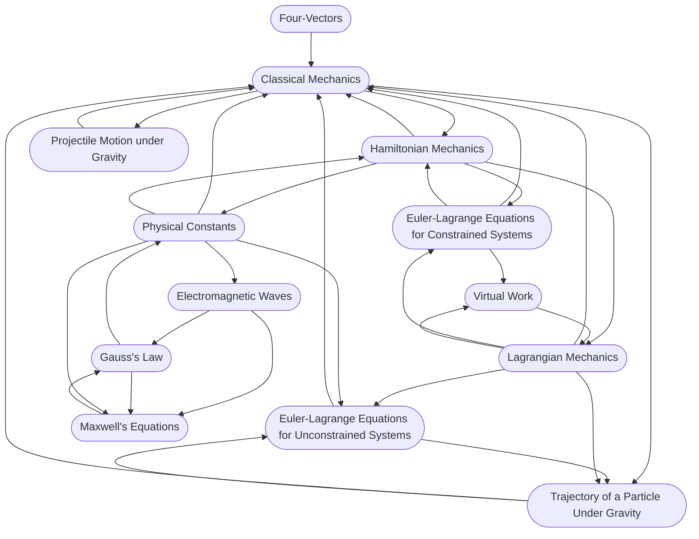

# Physics Knowledge Base - Visual Concept Map

```mermaid
graph TD
  classical_mechanics([Classical Mechanics])
  electromagnetic_waves([Electromagnetic Waves])
  eulerlagrange_equations_for_constrained_systems([Euler-Lagrange Equations for Constrained Systems])
  eulerlagrange_equations_for_unconstrained_systems([Euler-Lagrange Equations for Unconstrained Systems])
  four_vectors([Four-Vectors])
  gauss_law([Gauss's Law])
  hamiltonian_mechanics([Hamiltonian Mechanics])
  lagrangian_mechanics([Lagrangian Mechanics])
  maxwell_s_equations([Maxwell's Equations])
  physical_constants([Physical Constants])
  projectile_motion([Projectile Motion under Gravity])
  trajectory_under_gravity([Trajectory of a Particle Under Gravity])
  virtual_work([Virtual Work])
  classical_mechanics --> hamiltonian_mechanics
  classical_mechanics --> projectile_motion
  classical_mechanics --> trajectory_under_gravity
  electromagnetic_waves --> gauss_law
  electromagnetic_waves --> maxwell_s_equations
  eulerlagrange_equations_for_constrained_systems --> classical_mechanics
  eulerlagrange_equations_for_constrained_systems --> hamiltonian_mechanics
  eulerlagrange_equations_for_constrained_systems --> virtual_work
  eulerlagrange_equations_for_unconstrained_systems --> classical_mechanics
  eulerlagrange_equations_for_unconstrained_systems --> trajectory_under_gravity
  four_vectors --> classical_mechanics
  gauss_law --> maxwell_s_equations
  gauss_law --> physical_constants
  hamiltonian_mechanics --> classical_mechanics
  hamiltonian_mechanics --> eulerlagrange_equations_for_constrained_systems
  hamiltonian_mechanics --> lagrangian_mechanics
  hamiltonian_mechanics --> physical_constants
  lagrangian_mechanics --> classical_mechanics
  lagrangian_mechanics --> eulerlagrange_equations_for_constrained_systems
  lagrangian_mechanics --> eulerlagrange_equations_for_unconstrained_systems
  lagrangian_mechanics --> trajectory_under_gravity
  lagrangian_mechanics --> virtual_work
  maxwell_s_equations --> gauss_law
  physical_constants --> classical_mechanics
  physical_constants --> electromagnetic_waves
  physical_constants --> eulerlagrange_equations_for_unconstrained_systems
  physical_constants --> hamiltonian_mechanics
  physical_constants --> maxwell_s_equations
  projectile_motion --> classical_mechanics
  trajectory_under_gravity --> classical_mechanics
  trajectory_under_gravity --> eulerlagrange_equations_for_unconstrained_systems
  virtual_work --> lagrangian_mechanics
```
