# Hamiltonian Mechanics

## Summary
Hamiltonian mechanics is a high-level reformulation of [[classical mechanics]] that provides a powerful framework for understanding the deep geometric structures of dynamical systems. By transitioning from the second-order differential equations of [[Lagrangian Mechanics]] to a system of first-order equations, it simplifies the description of motion and serves as the formal foundation for both [[statistical mechanics]] and [[quantum mechanics]].

## Configuration Space vs. Phase Space (LDS: 95)
Hamiltonian mechanics provides a complementary formulation of [[Lagrangian Mechanics]], exploring **phase space** instead of **configuration space**. In the Lagrangian formalism, the state of a system with $n$ degrees of freedom is specified by $n$ generalized coordinates $q_i$ and $n$ velocities $\dot{q}_i$. This trajectory is analyzed in the $n$-dimensional configuration space, where the dynamics are governed by the minimization of the action.

In contrast, the Hamiltonian formalism utilizes $n$ coordinates $q_i$ and $n$ conjugate momenta $p_i$, treating them as $2n$ independent variables. This defines the **phase space**. The shift from $n$ second-order equations to $2n$ first-order equations reveals the underlying **symplectic structure** of classical dynamics, where time evolution is viewed as a flow that preserves phase-space volume.

```mermaid
graph LR
    L[Lagrangian L] -->|Legendre Transform| H[Hamiltonian H]
    L --> CS[Configuration Space q, q̇]
    H --> PS[Phase Space q, p]
    CS --> SO[n Second-Order ODEs]
    PS --> FO[2n First-Order ODEs]
```

![[pendulum-phase-portrait-matrix.svg]]

## Derivation via Legendre Transformation (LDS: 85)
To transition from the Lagrangian $L(q, \dot{q}, t)$ to the Hamiltonian $H(q, p, t)$, we define the **canonical momentum** $p_i$ as:

$$
p_i \equiv \frac{\partial L}{\partial \dot{q}_i}
$$

The Hamiltonian is then constructed via a **Legendre transformation**:

$$
H(q, p, t) = \sum_{i=1}^{n} p_i \dot{q}_i - L(q, \dot{q}, t)
$$

By taking the total differential $dH$ and comparing it with the differential of the definition, we arrive at **Hamilton's Canonical Equations**:

$$
\dot{q}_i = \frac{\partial H}{\partial p_i}, \quad \dot{p}_i = -\frac{\partial H}{\partial q_i}
$$

These equations describe the motion as a flow in phase space generated by the gradient of the Hamiltonian.

## Poisson Brackets and Algebraic Structure (LDS: 75)
The **Poisson Bracket** of two functions $f(q, p)$ and $g(q, p)$ is defined as:

$$
\{f, g\} = \sum_{i=1}^{n} \left( \frac{\partial f}{\partial q_i} \frac{\partial g}{\partial p_i} - \frac{\partial f}{\partial p_i} \frac{\partial g}{\partial q_i} \right)
$$

This bracket defines a Lie algebra on the space of observables. The time evolution of any physical quantity $f$ can be expressed as:

$$
\frac{df}{dt} = \{f, H\} + \frac{\partial f}{\partial t}
$$

This structure is the classical limit of the Heisenberg equation in [[quantum-mechanics]], where the Poisson bracket maps to the commutator: $\{f, g\} \rightarrow \frac{1}{i\hbar}[\hat{f}, \hat{g}]$.

## Conservation Laws and Liouville's Theorem (LDS: 60)
1.  **Energy Conservation**: If $\frac{\partial H}{\partial t} = 0$, then $H$ is a constant of motion ($dH/dt = 0$). In many cases, $H = T + V$, representing the total energy.
2.  **Liouville's Theorem**: The phase-space density $\rho$ of a system of particles is conserved along the trajectories of the system.
    $$
    \frac{\partial \rho}{\partial t} + \{\rho, H\} = 0
    $$
    This implies that the volume of any region in phase space is invariant under the Hamiltonian flow, a property critical for [[statistical mechanics]].

## Applications and Extensions (LDS: 30)
*   **Electromagnetism**: A particle in an EM field has a Hamiltonian $H = \frac{1}{2m}(\mathbf{p} - q\mathbf{A})^2 + q\phi$, illustrating the coupling of momentum to the vector potential $\mathbf{A}$.
*   **Relativity**: Utilizing [[four-vectors]], the relativistic Hamiltonian for a free particle is $H = \sqrt{p^2 c^2 + m^2 c^4}$, which preserves Lorentz covariance.

---SIMULATION:python:phase_space_sho.py---
import numpy as np
import matplotlib.pyplot as plt

def simulate_sho(k=1.0, m=1.0, q0=1.0, p0=0.0, dt=0.01, steps=1000):
    q, p = np.zeros(steps), np.zeros(steps)
    q[0], p[0] = q0, p0
    for i in range(1, steps):
        # Hamilton's Equations: dq/dt = p/m, dp/dt = -kq
        q[i] = q[i-1] + (p[i-1] / m) * dt
        p[i] = p[i-1] + (-k * q[i-1]) * dt
    return q, p

q, p = simulate_sho()
plt.figure(figsize=(6, 6))
plt.plot(q, p, label='Phase Trajectory')
plt.title('Phase Space: Simple Harmonic Oscillator')
plt.xlabel('Position (q)')
plt.ylabel('Momentum (p)')
plt.grid(True)
plt.axhline(0, color='black', lw=1)
plt.axvline(0, color='black', lw=1)
plt.legend()
plt.show()

## References
- [[[Classical Mechanics]] (3rd Edition)](https://www.pearson.com/en-us/subject-catalog/p/classical-mechanics/P200000007133) - Goldstein, H., Poole, C., & Safko, J. (2001).
- [Mechanics: Volume 1 (Course of Theoretical Physics)](https://doi.org/10.1016/C2009-0-24401-4) - Landau, L. D., & Lifshitz, E. M. (1976).
- [A Short History of Hamiltonian Mechanics](https://arxiv.org/abs/physics/0411195) - Sardanashvily, G. (2004).
- [[Noether's Theorem]] - Relating symmetries to conserved quantities.
- [[Physical Constants]] - Fundamental values used in Hamiltonian dynamics.
