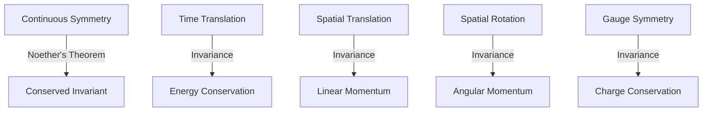

# Lagrangian Mechanics

Summary: This note explores the core principles of Lagrangian Mechanics, delving into its mathematical foundations and physical consequences.


## Summary and Physical Intuition

Lagrangian mechanics offers a profound reformulation of the principles of [[Classical Mechanics]], moving from the **vectorial approach** of [[Newtonian Mechanics]] to a **variational approach** based on scalar quantities. While Newtonian mechanics focuses on the instantaneous causal relationship between forces and accelerations ($\mathbf{F} = m\mathbf{a}$), Lagrangian mechanics views the entire history of a system's motion as a single path that extremizes a fundamental quantity called the **Action**.

### Hamilton's Principle of Stationary Action

At the heart of Lagrangian mechanics lies **Hamilton's Principle**, which states that the actual path taken by a dynamic system between two configurations $q(t_1)$ and $q(t_2)$ is the one for which the **Action integral** $S$ is stationary (usually a minimum).

The Action $S$ is defined as the time integral of the **Lagrangian** $L$:
$$S = \int_{t_1}^{t_2} L(q, \dot{q}, t) \, dt$$
where $L = T - V$, with $T$ being the kinetic energy and $V$ the potential energy. The condition for a stationary path is given by the vanishing of the first variation:
$$\delta S = \delta \int_{t_1}^{t_2} L(q, \dot{q}, t) \, dt = 0$$

![[least-action-principle.svg]]

This principle suggests that nature "seeks out" the most efficient path. Unlike the local nature of Newton's laws, Hamilton's principle is **global** and **teleological** in appearance, though it is mathematically equivalent to the differential equations of motion.

### Limitations of Newtonian Mechanics and the Vectorial Approach

The transition to the Lagrangian formalism is motivated by several inherent difficulties in the Newtonian framework:
1.  **Constraint Forces**: In many systems, particles are constrained (e.g., a bead on a wire or a rigid body). Newtonian mechanics requires the explicit calculation of "constraint forces" (normal forces, tension) which often do not do work and are not known *a priori*.
2.  **Coordinate Dependency**: Newton's laws are most naturally expressed in Cartesian coordinates. Transforming $\mathbf{F} = m\mathbf{a}$ into curvilinear coordinates (like spherical or cylindrical) introduces "fictitious forces" (Coriolis, centrifugal) that complicate the vectors.
3.  **Vector Summation**: Newtonian mechanics requires the vector sum of all forces, which becomes geometrically complex for systems with many degrees of freedom.

In contrast, the Lagrangian is a **scalar function**, making it invariant under coordinate transformations and allowing for a seamless treatment of complex geometries.

### Configuration Space and [[Generalized Coordinates]]

Lagrangian mechanics simplifies systems by utilizing **Configuration Space**. For a system with $N$ particles and $k$ constraints, we define $n = 3N - k$ **[[Generalized Coordinates]]** $q_1, q_2, \dots, q_n$.
- These coordinates completely specify the state of the system without needing to satisfy constraint equations explicitly.
- The path of the system is represented as a single point moving through an $n$-dimensional manifold known as the **Configuration Space**.

![[lagrange-mech.jpg]]

### Physical Interpretation of the Lagrangian $L = T - V$

The choice of $L = T - V$ may initially seem counterintuitive compared to the total energy $E = T + V$. However, its physical significance can be understood through **D'Alembert's Principle** of [[Virtual Work]].

1.  **Balance of Dynamics**: The Lagrangian represents the difference between the "ordered" motion (Kinetic Energy) and the "stored" work (Potential Energy).
2.  **Stationarity of Difference**: Hamilton's principle implies that over a given interval, the system evolves such that the *average difference* between kinetic and potential energy is minimized. If $T$ is much larger than $V$, the particle moves too fast; if $V$ is much larger than $T$, it moves too slow. The "true" path is a delicate balance between the two.

---

### References
- [The Principle of Least Action as Interpreted by Nature and by the Observer](https://doi.org/10.48550/arXiv.1203.2736) - M. Gondran, A. Gondran (2012)
- [Duality of the Principle of Least Action: A New Formulation of [[Classical Mechanics]]](https://doi.org/10.48550/arXiv.2109.09094) - D. J. Tannor (2021)
- *[[Classical Mechanics]]* - Herbert Goldstein, Charles P. Poole Jr., John L. Safko (3rd Edition)


## Mathematical Formalism and Variational Calculus

The transition from the vectorial mechanics of Newton to the analytical mechanics of Lagrange is underpinned by the **Calculus of Variations**. Instead of analyzing forces at every instant, we consider the entire trajectory of a system as a single entity and seek to extremize a specific physical quantity.

### The [[Calculus of Variations]] and Hamilton's Principle

At the heart of Lagrangian mechanics lies **Hamilton's Principle of Stationary Action**. It posits that the actual path taken by a physical system between two states at times $t_1$ and $t_2$ is the one for which the **Action Integral** is stationary (typically a minimum) with respect to small variations in the path.

The action $S$ is a **functional**—a mapping from a space of functions (paths) to the real numbers—defined as:

$$S[q(t)] = \int_{t_1}^{t_2} L(q, \dot{q}, t) \, dt$$

where $L = T - V$ is the [[Lagrangian]]. Hamilton's principle states:

$$\delta S = \delta \int_{t_1}^{t_2} L(q, \dot{q}, t) \, dt = 0$$

![[calculus-of-variations.svg]]

This principle suggests that nature is "economical," choosing paths that optimize the time-integrated difference between kinetic and potential energy.

### Functional Derivatives and the Action Integral

To handle variations in paths, we define a family of neighboring paths $q(t, \epsilon)$ that all share the same fixed endpoints:

$$q(t, \epsilon) = q(t, 0) + \epsilon \eta(t)$$

where $q(t, 0)$ is the extremizing path, $\epsilon$ is a small parameter, and $\eta(t)$ is an arbitrary, differentiable "test function" such that $\eta(t_1) = \eta(t_2) = 0$. The variation of the action $\delta S$ is defined as the first-order change in $S$ with respect to $\epsilon$:

$$\delta S = \left[ \frac{d}{d\epsilon} S[q(t, \epsilon)] \right]_{\epsilon=0} \delta \epsilon$$

The **functional derivative** $\frac{\delta S}{\delta q}$ represents the sensitivity of the action to local perturbations in the path.

### Derivation of the [[Euler-Lagrange Equations for Unconstrained Systems|Euler-Lagrange Equations]]

To derive the equations of motion, we expand the variation of the Lagrangian to first order in $\epsilon$:

$$\delta S = \int_{t_1}^{t_2} \left( \frac{\partial L}{\partial q} \delta q + \frac{\partial L}{\partial \dot{q}} \delta \dot{q} \right) dt$$

Using the fact that $\delta \dot{q} = \frac{d}{dt} (\delta q)$, we apply **integration by parts** to the second term:

$$\int_{t_1}^{t_2} \frac{\partial L}{\partial \dot{q}} \frac{d}{dt} (\delta q) \, dt = \left[ \frac{\partial L}{\partial \dot{q}} \delta q \right]_{t_1}^{t_2} - \int_{t_1}^{t_2} \frac{d}{dt} \left( \frac{\partial L}{\partial \dot{q}} \right) \delta q \, dt$$

The boundary term vanishes because $\delta q(t_1) = \delta q(t_2) = 0$. Substituting this back into the action variation:

$$\delta S = \int_{t_1}^{t_2} \left( \frac{\partial L}{\partial q} - \frac{d}{dt} \frac{\partial L}{\partial \dot{q}} \right) \delta q(t) \, dt = 0$$

According to the **Fundamental Lemma of the Calculus of Variations**, if this integral is zero for any arbitrary $\delta q(t)$, the integrand itself must vanish. This yields the [[Euler-Lagrange Equations for Unconstrained Systems|Euler-Lagrange equations]]:

$$\frac{d}{dt} \left( \frac{\partial L}{\partial \dot{q}_i} \right) - \frac{\partial L}{\partial q_i} = 0$$

For a system with $N$ degrees of freedom, this represents a set of $N$ second-order ordinary differential equations.

### Coordinate Covariance and Transformation Invariance

A profound advantage of the Lagrangian formalism is its **coordinate covariance**. Newton's Second Law, $\mathbf{F} = m\mathbf{a}$, is tied to an inertial frame and requires careful handling of "fictitious forces" in non-inertial systems.

In contrast, the Lagrangian $L$ is a scalar quantity. If we perform a coordinate transformation $q_i = q_i(Q_1, \dots, Q_n, t)$, the form of the Euler-Lagrange equations remains invariant:

$$\frac{d}{dt} \left( \frac{\partial L}{\partial \dot{Q}_j} \right) - \frac{\partial L}{\partial Q_j} = 0$$

This invariance allows us to choose [[Generalized Coordinates]] that best reflect the symmetries or constraints of the system (e.g., polar coordinates for central force motion), greatly simplifying the resulting mathematics.

---SIMULATION:python:lagrangian_minimization.py---
import numpy as np
import matplotlib.pyplot as plt
from scipy.integrate import quad

def calculate_action(path_func, velocity_func, t_span, L_func):
    """Calculates the action S for a given path."""
    integrand = lambda t: L_func(path_func(t), velocity_func(t), t)
    action, _ = quad(integrand, t_span[0], t_span[1])
    return action

# Define a simple system: Free particle (V=0, T=0.5 * m * v^2)
m = 1.0
L = lambda q, v, t: 0.5 * m * v**2

# Boundary conditions: q(0)=0, q(1)=1. The true path is q(t) = t.
t_start, t_end = 0, 1
q_start, q_end = 0, 1

# Define paths: q(t) = t + alpha * sin(pi * t)
# alpha = 0 is the physical path (minimum action)
alphas = np.linspace(-1, 1, 20)
actions = []

t_vals = np.linspace(t_start, t_end, 100)

plt.figure(figsize=(12, 5))

# Plot paths
plt.subplot(1, 2, 1)
for alpha in alphas:
    path = t_vals + alpha * np.sin(np.pi * t_vals)
    plt.plot(t_vals, path, color='gray', alpha=0.3)

    # Calculate action for this alpha
    v_func = lambda t: 1 + alpha * np.pi * np.cos(np.pi * t)
    q_func = lambda t: t + alpha * np.sin(np.pi * t)
    actions.append(calculate_action(q_func, v_func, (t_start, t_end), L))

# Highlight true path
plt.plot(t_vals, t_vals, 'r', linewidth=2, label='Physical Path ($\delta S=0$)')
plt.title("Path Variations $q(t, \\alpha)$")
plt.xlabel("Time $t$")
plt.ylabel("Position $q$")
plt.legend()

# Plot Action vs Alpha
plt.subplot(1, 2, 2)
plt.plot(alphas, actions, 'bo-')
plt.axvline(0, color='r', linestyle='--')
plt.title("Action $S[q]$ vs Variation Parameter $\\alpha$")
plt.xlabel("$\\alpha$")
plt.ylabel("Action $S$")
plt.grid(True)

plt.tight_layout()
plt.savefig('action_minimization.png')
print("Simulation complete. Action minimization plot saved as action_minimization.png")

---

### References
- [The Stationary Action Principle](https://doi.org/10.1093/oso/9780198822370.003.0007) - Peter Mann (2018)
- *[[Classical Mechanics]]* - Herbert Goldstein, Charles P. Poole, and John L. Safko (3rd Edition, 2001)
- [The Principle of Least Action](https://www.feynmanlectures.caltech.edu/II_19.html) - Richard Feynman, *The Feynman Lectures on Physics*, Volume II, Chapter 19.


## Symmetries and Conservation Laws

In [[Lagrangian Mechanics]], the deep connection between the physical symmetries of a system and its fundamental conservation laws is made explicit through the formalism of variational calculus. While Newtonian mechanics often treats conservation laws as empirical consequences of the laws of motion, analytical mechanics reveals them as deep structural properties of [[Space-time|space-time]] and the [[Lagrangian]] itself.

### [[Noether's Theorem]]: Symmetries and Invariants

Noether's Theorem is perhaps the most profound result in theoretical physics, stating that every continuous symmetry of the [[Action integral|action]] corresponds to a conserved quantity (an invariant).

#### Mathematical Derivation
Consider a transformation of the [[Generalized Coordinates]] $q_i$ parameterized by a small constant $\epsilon$:
$$q_i(t) \to q_i(t, \epsilon) = q_i(t) + \epsilon \psi_i(q, t)$$
The transformation is a **symmetry** if the Lagrangian $L(q, \dot{q}, t)$ remains invariant up to a total time derivative:
$$\frac{dL}{d\epsilon}\bigg|_{\epsilon=0} = \frac{dF(q, t)}{dt}$$
Expanding the derivative using the chain rule:
$$\sum_i \left( \frac{\partial L}{\partial q_i} \psi_i + \frac{\partial L}{\partial \dot{q}_i} \dot{\psi}_i \right) = \frac{dF}{dt}$$
Substituting the [[Euler-Lagrange Equations for Unconstrained Systems|Euler-Lagrange equations]] $\frac{\partial L}{\partial q_i} = \frac{d}{dt} \frac{\partial L}{\partial \dot{q}_i}$:
$$\sum_i \left( \psi_i \frac{d}{dt} \frac{\partial L}{\partial \dot{q}_i} + \frac{\partial L}{\partial \dot{q}_i} \frac{d\psi_i}{dt} \right) = \frac{d}{dt} \left( \sum_i \left( \frac{\partial L}{\partial \dot{q}_i} \psi_i \right) \right) = \frac{dF}{dt}$$
Thus, we identify the conserved quantity $J$:
$$J = \sum_i \frac{\partial L}{\partial \dot{q}_i} \psi_i - F = \text{constant}$$



### Conjugate Momenta and Cyclic Coordinates

A coordinate $q_k$ is termed **cyclic** (or ignorable) if it does not appear explicitly in the Lagrangian:
$$\frac{\partial L}{\partial q_k} = 0$$
From the Euler-Lagrange equations:
$$\frac{d}{dt} \left( \frac{\partial L}{\partial \dot{q}_k} \right) - \frac{\partial L}{\partial q_k} = 0 \implies \frac{d}{dt} \left( \frac{\partial L}{\partial \dot{q}_k} \right) = 0$$
The quantity $p_k = \frac{\partial L}{\partial \dot{q}_k}$ is defined as the **generalized momentum conjugate** to $q_k$. For a cyclic coordinate, the conjugate momentum is a constant of motion.

### Spatial Translation Invariance and Momentum Conservation

Consider a system of $N$ particles. If the Lagrangian is invariant under a uniform translation of all particles by a vector $\mathbf{\epsilon}$:
$$\mathbf{r}_i \to \mathbf{r}_i + \mathbf{\epsilon}$$
The change in the Lagrangian is:
$$\delta L = \sum_i \frac{\partial L}{\partial \mathbf{r}_i} \cdot \delta \mathbf{r}_i = \mathbf{\epsilon} \cdot \sum_i \frac{\partial L}{\partial \mathbf{r}_i} = 0$$
Since $\frac{\partial L}{\partial \mathbf{r}_i} = \dot{\mathbf{p}}_i$, this implies $\sum_i \dot{\mathbf{p}}_i = \frac{d}{dt} \mathbf{P} = 0$, where $\mathbf{P}$ is the total linear momentum.

> [!INFO] Physical Intuition
> Translation invariance implies that the "absolute position" in space does not affect the dynamics; only relative distances matter. This homogeneity of space is the root of linear momentum conservation.

### Time Invariance and the Jacobi Integral

If the Lagrangian does not depend explicitly on time ($\partial L / \partial t = 0$), the system is invariant under time translation $t \to t + \delta t$.
The total time derivative of $L(q, \dot{q})$ is:
$$\frac{dL}{dt} = \sum_i \frac{\partial L}{\partial q_i} \dot{q}_i + \sum_i \frac{\partial L}{\partial \dot{q}_i} \ddot{q}_i$$
Using the Euler-Lagrange equations $\frac{\partial L}{\partial q_i} = \frac{d}{dt} \frac{\partial L}{\partial \dot{q}_i}$:
$$\frac{dL}{dt} = \sum_i \dot{q}_i \frac{d}{dt} \left( \frac{\partial L}{\partial \dot{q}_i} \right) + \sum_i \frac{\partial L}{\partial \dot{q}_i} \ddot{q}_i = \frac{d}{dt} \left( \sum_i \dot{q}_i \frac{\partial L}{\partial \dot{q}_i} \right)$$
Rearranging gives the **Jacobi Integral** $h$:
$$h = \sum_i \dot{q}_i \frac{\partial L}{\partial \dot{q}_i} - L = \text{constant}$$
For systems where the kinetic energy $T$ is a homogeneous quadratic function of $\dot{q}$ and the potential $V$ is independent of $\dot{q}$, $h$ reduces to the total energy $E = T + V$.

![[400px-noether-theorem-conservation-laws.png]]

---SIMULATION:python:angular_momentum_conservation.py---
import numpy as np
import matplotlib.pyplot as plt

def simulate_central_force(t_max=20, dt=0.01):
    # Potential V(r) = -1/r (Kepler problem)
    # L = 1/2 m (r_dot^2 + r^2 theta_dot^2) + 1/r
    # Equations of motion in Cartesian for simplicity
    def get_accel(pos):
        r = np.linalg.norm(pos)
        return -pos / r**3

    # Initial conditions: circular-ish orbit
    pos = np.array([1.0, 0.0])
    vel = np.array([0.0, 0.8])

    steps = int(t_max / dt)
    history_pos = np.zeros((steps, 2))
    history_L = np.zeros(steps)

    for i in range(steps):
        history_pos[i] = pos
        # Angular momentum L_z = r x p = m (x*v_y - y*v_x)
        history_L[i] = pos[0]*vel[1] - pos[1]*vel[0]

        # RK4 integration
        k1_v = get_accel(pos)
        k1_p = vel

        k2_v = get_accel(pos + 0.5*dt*k1_p)
        k2_p = vel + 0.5*dt*k1_v

        k3_v = get_accel(pos + 0.5*dt*k2_p)
        k3_p = vel + 0.5*dt*k2_v

        k4_v = get_accel(pos + dt*k3_p)
        k4_p = vel + dt*k3_v

        vel += (dt/6.0) * (k1_v + 2*k2_v + 2*k3_v + k4_v)
        pos += (dt/6.0) * (k1_p + 2*k2_p + 2*k3_p + k4_p)

    # Plotting
    fig, (ax1, ax2) = plt.subplots(1, 2, figsize=(12, 5))

    ax1.plot(history_pos[:, 0], history_pos[:, 1], 'b-')
    ax1.set_title("Particle Trajectory (Central Potential)")
    ax1.set_xlabel("x")
    ax1.set_ylabel("y")
    ax1.axis('equal')
    ax1.grid(True)

    ax2.plot(np.linspace(0, t_max, steps), history_L, 'r-')
    ax2.set_ylim(0, 1.5)
    ax2.set_title("Angular Momentum $L_z$ vs Time")
    ax2.set_xlabel("Time")
    ax2.set_ylabel("$L_z$")
    ax2.grid(True)

    plt.tight_layout()
    plt.savefig('angular_momentum_conservation.png')
    plt.show()

if __name__ == "__main__":
    simulate_central_force()

### References
- [Invariant Variation Problems](https://doi.org/10.1080/00411457108231446) - Emmy Noether (1918), Trans. M. A. Tavel (1971).
- [Noether's Theorem in a Nutshell](https://arxiv.org/abs/physics/0503066) - Kosmann-Schwarzbach (2005).
- *[[Classical Mechanics]]* - Herbert Goldstein (3rd Ed, 2001).
- *Analytical Mechanics* - L.N. Hand and J.D. Finch (1998).


---
title: "Advanced Formalisms and Constraints in Lagrangian Mechanics"
tags: [physics, lagrangian-mechanics, analytical-mechanics]
date: 2026-02-13
complexity: advanced
---

## Advanced Formalisms and Constraints

The power of [[Lagrangian Mechanics]] lies in its ability to systematically handle systems where motion is restricted by physical boundaries or connections. In the Newtonian framework, these constraints require the explicit calculation of "constraint forces" (like tension or normal force), which are often unknowns. Analytical mechanics bypasses this by embedding constraints directly into the geometry of the configuration space or by using variational techniques.

### Holonomic vs. Non-Holonomic Constraints

Constraints are mathematical restrictions on the coordinates $q_i$ and velocities $\dot{q}_i$ of a system.

#### 1. Holonomic Constraints
A constraint is **holonomic** if it can be expressed as an algebraic equation relating the coordinates and time:
$$f(q_1, q_2, \dots, q_n, t) = 0$$
Systems with only holonomic constraints are called *holonomic systems*. These constraints reduce the number of independent degrees of freedom ($DOF$). If there are $k$ such constraints in a system of $N$ particles (with $3N$ coordinates), the $DOF$ becomes $3N - k$.
*   **Physical Example**: A bead sliding on a rigid wire or a particle confined to the surface of a sphere ($x^2 + y^2 + z^2 - R^2 = 0$).

#### 2. Non-Holonomic Constraints
A constraint is **non-holonomic** if it cannot be expressed in the form $f(q, t) = 0$. These usually take the form of inequalities or non-integrable differential equations involving velocities:
*   **Inequalities**: A particle in a sphere of radius $R$: $x^2 + y^2 + z^2 \leq R^2$.
*   **Non-integrable Velocity Constraints**: A classic example is a vertical disk rolling without slipping on a horizontal plane. The constraints on the coordinates $(x, y, \phi, \theta)$ cannot be integrated to form a purely spatial relation.

![[400px-rollling-ball-nonholonomic.png]]

```mermaid
graph TD
    A[Constraints] --> B[Holonomic]
    A --> C[Non-Holonomic]
    B --> B1[Integrable: f(q, t) = 0]
    B --> B2[Reduces DOF]
    C --> C1[Inequalities: f(q, t) >= 0]
    C --> C2[Non-integrable Velocity Constraints]
    C --> C3[Does not reduce DOF in the same way]
```

### The Method of [[Euler-Lagrange Equations for Constrained Systems|Lagrange Multipliers]]

When we wish to find the constraint forces explicitly while maintaining the variational approach, we use **Lagrange Multipliers**.

Consider a system with a constraint $f(q, t) = 0$. Instead of reducing the coordinates, we vary the modified action integral:
$$\delta S = \delta \int_{t_1}^{t_2} \left[ L(q, \dot{q}, t) + \lambda(t) f(q, t) \right] dt = 0$$
where $\lambda(t)$ is an undetermined multiplier. The resulting equations of motion are:
$$\frac{d}{dt} \left( \frac{\partial L}{\partial \dot{q}_j} \right) - \frac{\partial L}{\partial q_j} = Q_j^c$$
Where the **Generalized Force of Constraint** $Q_j^c$ is given by:
$$Q_j^c = \lambda \frac{\partial f}{\partial q_j}$$
This allows for the simultaneous determination of the trajectory $q(t)$ and the physical force required to maintain the constraint $\lambda(t)$.

### [[Virtual Work]] and D'Alembert's Principle

Newton's second law for a system of particles is $\mathbf{F}_i = \dot{\mathbf{p}}_i$. We can rewrite this as:
$$\sum_i (\mathbf{F}_i - \dot{\mathbf{p}}_i) = 0$$
In a constrained system, the total force $\mathbf{F}_i$ is the sum of the applied force $\mathbf{F}_i^{(a)}$ and the constraint force $\mathbf{f}_i$. Applying a **virtual displacement** $\delta \mathbf{r}_i$ (an infinitesimal, instantaneous displacement consistent with the constraints):
$$\sum_i (\mathbf{F}_i^{(a)} + \mathbf{f}_i - \dot{\mathbf{p}}_i) \cdot \delta \mathbf{r}_i = 0$$
**D'Alembert's Principle** assumes that for ideal constraints (like rigid rods or frictionless surfaces), the virtual work done by constraint forces is zero: $\sum_i \mathbf{f}_i \cdot \delta \mathbf{r}_i = 0$. This yields:
$$\sum_i (\mathbf{F}_i^{(a)} - \dot{\mathbf{p}}_i) \cdot \delta \mathbf{r}_i = 0$$
This is the fundamental bridge between Newtonian mechanics and the [[Euler-Lagrange Equations for Unconstrained Systems|Euler-Lagrange Equations]]. It effectively "eliminates" the unknown constraint forces from the dynamics.

### Generalized Forces and Constraints

In terms of [[Generalized Coordinates]] $q_j$, the virtual work $\delta W$ is:
$$\delta W = \sum_i \mathbf{F}_i^{(a)} \cdot \delta \mathbf{r}_i = \sum_i \mathbf{F}_i^{(a)} \cdot \sum_j \frac{\partial \mathbf{r}_i}{\partial q_j} \delta q_j = \sum_j Q_j \delta q_j$$
where the **Generalized Force** $Q_j$ associated with coordinate $q_j$ is defined as:
$$Q_j = \sum_i \mathbf{F}_i^{(a)} \cdot \frac{\partial \mathbf{r}_i}{\partial q_j}$$
If the forces are conservative, $Q_j = -\frac{\partial V}{\partial q_j}$. For non-conservative forces (like friction), they appear on the right-hand side of the Lagrange equations:
$$\frac{d}{dt} \left( \frac{\partial L}{\partial \dot{q}_j} \right) - \frac{\partial L}{\partial q_j} = Q_j^{nc}$$

---SIMULATION:python:lagrange_multiplier_pendulum.py---
import numpy as np
import matplotlib.pyplot as plt
from scipy.integrate import solve_ivp

"""
Simulation of a Simple Pendulum using Lagrange Multipliers.
System: Particle (m) at (x,y) constrained to a circle of radius L.
Constraint: f(x, y) = x^2 + y^2 - L^2 = 0
Lagrangian: L = 1/2 * m * (vx^2 + vy^2) - m * g * y (y-axis down)
We solve the DAE (Differential-Algebraic Equations) by differentiating the constraint.
"""

# Parameters
g = 9.81
L = 1.0
m = 1.0

def derivatives(t, state):
    x, y, vx, vy = state

    # Using the differentiated constraint 2x*vx + 2y*vy = 0
    # and 2*vx^2 + 2x*ax + 2*vy^2 + 2y*ay = 0
    # Combined with E-L: m*ax = lambda * 2x, m*ay = m*g + lambda * 2y
    # We solve for lambda:
    # 2*vx^2 + 2*vy^2 + 2x*(2*lambda*x/m) + 2y*(g + 2*lambda*y/m) = 0
    # lambda * (4*x^2/m + 4*y^2/m) = -2*(vx^2 + vy^2 + y*g)
    # lambda = -m * (vx^2 + vy^2 + y*g) / (2 * (x^2 + y^2))

    denom = 2 * (x**2 + y**2)
    lam = -m * (vx**2 + vy**2 + y*g) / denom

    ax = (2 * lam * x) / m
    ay = g + (2 * lam * y) / m

    return [vx, vy, ax, ay]

# Initial conditions (starting from horizontal)
theta0 = np.pi/2
state0 = [L*np.sin(theta0), L*np.cos(theta0), 0, 0]

t_span = (0, 10)
t_eval = np.linspace(0, 10, 1000)

sol = solve_ivp(derivatives, t_span, state0, t_eval=t_eval, method='RK45')

# Plotting
plt.figure(figsize=(10, 5))
plt.subplot(1, 2, 1)
plt.plot(sol.y[0], sol.y[1])
plt.title("Trajectory in XY Plane")
plt.xlabel("x (m)")
plt.ylabel("y (m)")
plt.gca().invert_yaxis()
plt.axis('equal')

plt.subplot(1, 2, 2)
plt.plot(sol.t, sol.y[0], label='x')
plt.plot(sol.t, sol.y[1], label='y')
plt.title("Coordinates vs Time")
plt.legend()
plt.tight_layout()
plt.savefig('pendulum_lagrange.png')
print("Simulation complete. Plot saved as pendulum_lagrange.png")

### References
- [J. L. Lagrange's early contributions to the principles and methods of mechanics](https://doi.org/10.1007/BF00348431) - Craig Fraser (1983)
- [D'Alembert's Principle: The Original Formulation and Application](https://doi.org/10.1111/j.1600-0498.1985.tb00833.x) - Craig Fraser (1985)
- Goldstein, H. (2001). *[[Classical Mechanics]]*. Addison Wesley. (Foundational textbook on constraints and virtual work).


## Specialized Applications

In this section, we apply the [[Euler-Lagrange Equations for Unconstrained Systems|Euler-Lagrange equations]] to fundamental physical systems. These applications demonstrate the power of the Lagrangian approach in handling complex coordinate systems and non-conservative forces (like electromagnetism) through the use of generalized potentials.

---

### Central Force Motion and [[Trajectory of a Particle Under Gravity|Keplerian Orbits]]

The problem of two bodies interacting via a central force $F(r) = -\nabla V(r)$ is most naturally treated in configuration space using plane polar coordinates $(r, \theta)$.

#### 1. The Lagrangian and Conservation Laws
For a particle of mass $m$ (or reduced mass $\mu$ in a two-body system), the kinetic energy in polar coordinates is $T = \frac{1}{2}m(\dot{r}^2 + r^2\dot{\theta}^2)$. The Lagrangian is:

$$L = \frac{1}{2}m(\dot{r}^2 + r^2\dot{\theta}^2) - V(r)$$

Applying the Euler-Lagrange equations:
- **For $\theta$**: Since $\frac{\partial L}{\partial \theta} = 0$, the coordinate $\theta$ is **cyclic**. The conjugate momentum $p_\theta$ is conserved:
  $$p_\theta = \frac{\partial L}{\partial \dot{\theta}} = mr^2\dot{\theta} = l \quad \text{(Angular Momentum)}$$
- **For $r$**:
  $$\frac{d}{dt}(m\dot{r}) - mr\dot{\theta}^2 + \frac{\partial V}{\partial r} = 0 \implies m\ddot{r} = mr\dot{\theta}^2 - \frac{\partial V}{\partial r}$$

#### 2. The Effective Potential
Substituting $\dot{\theta} = \frac{l}{mr^2}$ into the radial equation yields a one-dimensional problem in $r$:
$$m\ddot{r} = \frac{l^2}{mr^3} - \frac{\partial V}{\partial r} = -\frac{\partial}{\partial r} \left( V(r) + \frac{l^2}{2mr^2} \right)$$
The term $V_{\text{eff}}(r) = V(r) + \frac{l^2}{2mr^2}$ is the **effective potential**, where $\frac{l^2}{2mr^2}$ represents the "centrifugal barrier."

![[effective-potential.png]]
*Figure 1: The effective potential for a $1/r$ gravitational field. The shape of the orbit (circular, elliptical, parabolic, or hyperbolic) is determined by the total energy $E$ relative to $V_{\text{eff}}$.*

---

### Small Oscillations and Normal Mode Analysis

When a system is near a stable equilibrium point $q_0$, we can linearize the equations of motion. Let $\eta_i = q_i - q_{i0}$ be small displacements.

#### 1. Quadratic Expansion
Expanding $T$ and $V$ to second order around $q_0$:
- **Potential Energy**: $V(\eta) \approx V(q_0) + \sum \left( \frac{\partial V}{\partial q_i} \right)_0 \eta_i + \frac{1}{2} \sum V_{ij} \eta_i \eta_j$. Since $q_0$ is equilibrium, the first derivative vanishes.
- **Kinetic Energy**: $T(\dot{\eta}) \approx \frac{1}{2} \sum T_{ij} \dot{\eta}_i \dot{\eta}_j$, where $T_{ij}$ is evaluated at $q_0$.

The Lagrangian becomes:
$$L = \frac{1}{2} \sum_{i,j} (T_{ij} \dot{\eta}_i \dot{\eta}_j - V_{ij} \eta_i \eta_j)$$

#### 2. The Secular Equation
The equations of motion are $\sum_j (T_{ij} \ddot{\eta}_j + V_{ij} \eta_j) = 0$. Assuming harmonic solutions $\eta_j = a_j e^{i\omega t}$, we obtain the generalized eigenvalue problem:
$$\det(\mathbf{V} - \omega^2 \mathbf{T}) = 0$$
The roots $\omega_\alpha^2$ are the frequencies of the **normal modes**, and the corresponding eigenvectors define the **normal coordinates** which decouple the system into independent simple harmonic oscillators.

---

### Rigid Body Dynamics and Euler Angles

A rigid body has 6 degrees of freedom (3 translational, 3 rotational). In the body-fixed frame, the rotational kinetic energy is:
$$T_{\text{rot}} = \frac{1}{2} \boldsymbol{\omega} \cdot \mathbf{I} \cdot \boldsymbol{\omega} = \frac{1}{2} (I_1 \omega_1^2 + I_2 \omega_2^2 + I_3 \omega_3^2)$$
where $I_i$ are principal moments of inertia.

#### 1. Euler Angles (Z-X-Z Convention)
To express $L$ in terms of generalized coordinates, we use Euler angles $(\phi, \theta, \psi)$:
1.  **Precession** ($\phi$): Rotation about the fixed $Z$-axis.
2.  **Nutation** ($\theta$): Rotation about the line of nodes.
3.  **Spin** ($\psi$): Rotation about the body $z$-axis.

![[eulerangles.svg]]

The angular velocity components in the body-fixed frame are:
$$\omega_1 = \dot{\phi}\sin\theta\sin\psi + \dot{\theta}\cos\psi$$
$$\omega_2 = \dot{\phi}\sin\theta\cos\psi - \dot{\theta}\sin\psi$$
$$\omega_3 = \dot{\phi}\cos\theta + \dot{\psi}$$

For a symmetric top ($I_1 = I_2$), the Lagrangian $L = T_{\text{rot}} - V(\theta)$ is cyclic in $\phi$ and $\psi$, leading to the conservation of $p_\phi$ and $p_\psi$.

---

### The Lagrangian of a Particle in an Electromagnetic Field

A charged particle $q$ in an EM field experiences the Lorentz force $\mathbf{F} = q(\mathbf{E} + \mathbf{v} \times \mathbf{B})$. Since this force is velocity-dependent, it cannot be derived from a simple potential $V(\mathbf{r})$.

#### 1. The Generalized Potential
Using the scalar potential $\Phi$ and vector potential $\mathbf{A}$ (where $\mathbf{E} = -\nabla\Phi - \frac{\partial \mathbf{A}}{\partial t}$ and $\mathbf{B} = \nabla \times \mathbf{A}$), we define a velocity-dependent potential:
$$U = q\Phi - q\mathbf{v} \cdot \mathbf{A}$$
The Lagrangian is:
$$L = T - U = \frac{1}{2}m\mathbf{v}^2 - q\Phi + q\mathbf{v} \cdot \mathbf{A}$$

#### 2. Derivation of the Lorentz Force
Applying E-L to $x$: $\frac{d}{dt}\frac{\partial L}{\partial \dot{x}} = \frac{\partial L}{\partial x}$
$$\frac{d}{dt}(m\dot{x} + qA_x) = -q\frac{\partial \Phi}{\partial x} + q\mathbf{v} \cdot \frac{\partial \mathbf{A}}{\partial x}$$
$$m\ddot{x} + q\left(\frac{\partial A_x}{\partial t} + (\mathbf{v} \cdot \nabla)A_x \right) = -q\frac{\partial \Phi}{\partial x} + q\frac{\partial (\mathbf{v} \cdot \mathbf{A})}{\partial x}$$
Using the vector identity $\nabla(\mathbf{v} \cdot \mathbf{A}) = (\mathbf{v} \cdot \nabla)\mathbf{A} + \mathbf{v} \times (\nabla \times \mathbf{A})$, this simplifies precisely to:
$$m\ddot{x} = q(E_x + (\mathbf{v} \times \mathbf{B})_x)$$

---

### References
- [[[Classical Mechanics]] (3rd Edition)](https://www.google.com/search?q=Goldstein+Classical+Mechanics+ISBN) - Herbert Goldstein (2001)
- [Mechanics: Volume 1 (Course of Theoretical Physics)](https://www.google.com/search?q=Landau+Lifshitz+Mechanics) - L.D. Landau and E.M. Lifshitz (1976)
- [Parametric Feedback Cooling of Rigid Body Nanodumbbells](https://doi.org/10.1103/PhysRevA.99.013821) - Ahn et al. (2019) (Example of modern rigid body application)
- [The Lagrangian for a particle in an electromagnetic field](https://doi.org/10.1119/1.13504) - J.S. Rigden (1983)

---

---SIMULATION:python:kepler_orbit.py---
import numpy as np
import matplotlib.pyplot as plt
from scipy.integrate import odeint

def kepler_derivs(u, t, G, M):
    """
    u = [x, y, vx, vy]
    """
    x, y, vx, vy = u
    r = np.sqrt(x**2 + y**2)
    ax = -G * M * x / r**3
    ay = -G * M * y / r**3
    return [vx, vy, ax, ay]

# Parameters
G = 1.0
M = 1.0
t = np.linspace(0, 10, 1000)

# Initial conditions (Elliptical Orbit)
# r0 = 1.0, v0 = 0.8 (v_circ = sqrt(GM/r) = 1.0)
u0 = [1.0, 0.0, 0.0, 0.8]

sol = odeint(kepler_derivs, u0, t, args=(G, M))

plt.figure(figsize=(8, 8))
plt.plot(sol[:, 0], sol[:, 1], label='Trajectory')
plt.plot(0, 0, 'ro', label='Central Mass')
plt.xlabel('x')
plt.ylabel('y')
plt.title('Keplerian Orbit: Numerical Integration of Euler-Lagrange Equations')
plt.legend()
plt.grid(True)
plt.axis('equal')
plt.show()


### Related Notes
- [[Hamiltonian Mechanics]]
