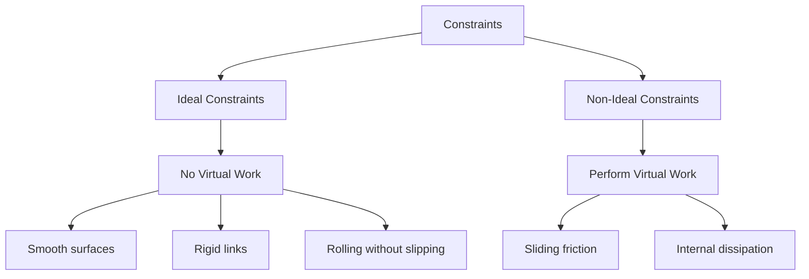
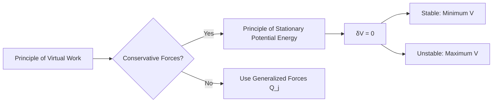
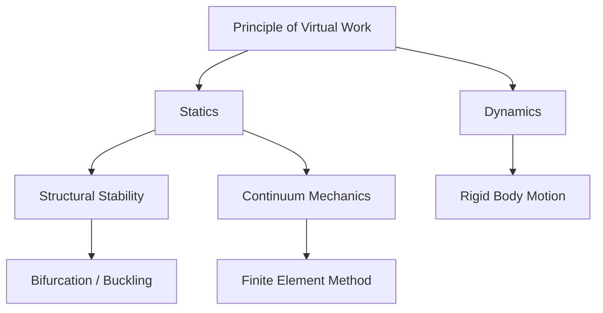

# Virtual Work

Summary: This note explores the core principles of Virtual Work, delving into its mathematical foundations and physical consequences.


## Fundamental Concepts

### Definition of Virtual Displacement
A **virtual displacement**, denoted by $\delta \mathbf{r}_i$, is an infinitesimal, instantaneous, and imaginary change in the coordinates of a system. Unlike a real displacement $d\mathbf{r}_i$, which occurs over an infinitesimal time interval $dt$, a virtual displacement is assumed to take place with time "frozen" ($dt=0$). 

For a system of $N$ particles, a virtual displacement must be consistent with the forces of constraint acting on the system at that specific instant $t$. If the system is subject to $k$ holonomic constraints of the form:
$$f_j(\mathbf{r}_1, \mathbf{r}_2, \dots, \mathbf{r}_N, t) = 0, \quad j = 1, \dots, k$$
then any set of virtual displacements $\{\delta \mathbf{r}_i\}$ must satisfy the linear variational condition:
$$\sum_{i=1}^N \nabla_i f_j \cdot \delta \mathbf{r}_i = 0$$
This implies that the virtual displacement vector is always tangent to the constraint surface (or manifold) defined by $f_j$.


### Distinction Between Real and Virtual Displacements
The distinction between real ($d\mathbf{r}$) and virtual ($\delta \mathbf{r}$) displacements is critical when dealing with **rheonomic** (time-dependent) constraints.

1.  **Temporal Dependence**: $d\mathbf{r}$ incorporates the motion of the constraint itself, while $\delta \mathbf{r}$ does not.
2.  **Mathematical Expansion**:
    Using [[Generalized Coordinates]] $q_1, q_2, \dots, q_n$, the total differential of the position vector $\mathbf{r}_i(q_1, \dots, q_n, t)$ is:
    $$d\mathbf{r}_i = \sum_{j=1}^n \frac{\partial \mathbf{r}_i}{\partial q_j} dq_j + \frac{\partial \mathbf{r}_i}{\partial t} dt$$
    In contrast, the virtual displacement is defined purely by the variations in coordinates:
    $$\delta \mathbf{r}_i = \sum_{j=1}^n \frac{\partial \mathbf{r}_i}{\partial q_j} \delta q_j$$
    Note that the term $\frac{\partial \mathbf{r}_i}{\partial t} dt$ is absent in the virtual case because $\delta t = 0$.

### The Principle of Virtual Work for Statics
The **Principle of Virtual Work** (PVW) provides a necessary and sufficient condition for the equilibrium of a mechanical system. It states that a system is in static equilibrium if and only if the total virtual work $\delta W$ done by all external and internal forces vanishes for every virtual displacement consistent with the constraints:
$$\delta W = \sum_{i=1}^N \mathbf{F}_i \cdot \delta \mathbf{r}_i = 0$$
where $\mathbf{F}_i$ is the total force acting on the $i$-th particle. In a constrained system, we can split $\mathbf{F}_i$ into **applied forces** $\mathbf{F}_i^{(a)}$ and **constraint forces** $\mathbf{f}_i$:
$$\sum_{i=1}^N \mathbf{F}_i^{(a)} \cdot \delta \mathbf{r}_i + \sum_{i=1}^N \mathbf{f}_i \cdot \delta \mathbf{r}_i = 0$$
For a large class of physical systems (ideal constraints), the second term vanishes, allowing us to determine equilibrium solely from the applied forces.

### Physical Intuition: The Vanishing Work of Constraints
The power of the PVW stems from the fact that for **ideal constraints**, the constraint forces do no work during a virtual displacement. This "workless" nature arises from the geometry of the constraint:
*   **Normal Forces**: For a particle moving on a smooth surface, the constraint force $\mathbf{N}$ is normal to the surface, while $\delta \mathbf{r}$ is tangent to it. Thus, $\mathbf{N} \cdot \delta \mathbf{r} = 0$.
*   **Tension**: In a system of particles connected by inextensible strings, the work done by tension on one end is exactly cancelled by the work done on the other end during a virtual displacement that preserves the string length.
*   **Rigid Bodies**: Internal forces between particles in a rigid body act along the line joining them. Any virtual displacement that preserves the distance between particles is perpendicular to these internal forces.

### Classification of Constraints: Ideal vs. Non-Ideal
Constraints are categorized based on whether they contribute to the virtual work:



*   **Ideal Constraints**: Defined as constraints where $\sum \mathbf{f}_i \cdot \delta \mathbf{r}_i = 0$. This allows the elimination of unknown constraint forces from the equations of equilibrium.
*   **Non-Ideal Constraints**: If friction is present, $\mathbf{f}_i \cdot \delta \mathbf{r}_i \neq 0$. In such cases, the principle must be extended by explicitly including the work of friction or using the **Principle of Virtual Work** in its inequality form for unilateral constraints.

---SIMULATION:python:virtual_work_lever.py---
import numpy as np
import matplotlib.pyplot as plt

def simulate_lever_equilibrium(L1=2.0, L2=1.0, F1=10.0):
    """
    Visualizes the Principle of Virtual Work on a simple lever.
    For equilibrium: F1*L1 = F2*L2.
    Virtual work: F1*dy1 + F2*dy2 = 0.
    """
    # Calculate F2 required for equilibrium
    F2 = F1 * (L1 / L2)
    
    # Lever coordinates (horizontal equilibrium)
    x = np.array([-L1, L2])
    y = np.array([0, 0])
    
    # Small virtual displacement (virtual rotation d_theta)
    d_theta = 0.15
    dy1 = -L1 * d_theta
    dy2 = L2 * d_theta
    
    fig, ax = plt.subplots(figsize=(10, 5))
    
    # Plot Lever
    ax.plot([-L1, L2], [0, 0], 'k-', lw=4, label='Lever Arm')
    ax.plot(0, 0, 'r^', ms=20, label='Fulcrum')
    
    # Plot Forces
    ax.arrow(-L1, 0, 0, -F1/5, width=0.05, color='blue', label=f'Applied Force F1={F1}N')
    ax.arrow(L2, 0, 0, -F2/5, width=0.05, color='green', label=f'Applied Force F2={F2:.1f}N')
    
    # Plot Virtual Displacements
    ax.arrow(-L1, 0, 0, dy1, width=0.03, ls='--', color='cyan', alpha=0.6, label='Virtual Disp. δy1')
    ax.arrow(L2, 0, 0, dy2, width=0.03, ls='--', color='orange', alpha=0.6, label='Virtual Disp. δy2')
    
    # Display Work Calculation
    W1 = F1 * dy1
    W2 = F2 * dy2
    total_W = W1 + W2
    
    ax.text(-L1, 1.5, f"δW1 = F1*δy1 = {W1:.2f} J", color='blue')
    ax.text(L2-1, 1.5, f"δW2 = F2*δy2 = {W2:.2f} J", color='green')
    ax.text(-0.5, 2.5, f"Total δW = {total_W:.2f} J", weight='bold', fontsize=12)
    
    ax.set_xlim(-L1-1, L2+1)
    ax.set_ylim(-4, 4)
    ax.set_title("Principle of Virtual Work: Lever Equilibrium")
    ax.grid(True, linestyle=':')
    ax.legend(loc='lower left')
    plt.show()

if __name__ == "__main__":
    simulate_lever_equilibrium()

#### References
- [Principle of virtual action in continuum mechanics](https://arxiv.org/abs/2403.20076) - Henri Gouin (2024)
- [The Principle of Virtual Work and Its Application in Structural Engineering](https://doi.org/10.1061/(ASCE)0733-9445(1984)110:11(2601)) - Various (1984)
- *Mécanique Analytique* - J. L. Lagrange (1788)


I will read the existing `notes/virtual-work.md` file to understand its current structure and content.
I will search for Wikipedia diagrams and high-quality references (DOI/arXiv) related to the mathematical formalism of virtual work, specifically focusing on generalized coordinates and generalized forces.
## Mathematical Formalism

The mathematical power of the principle of virtual work lies in its ability to transform a complex system of vector equations (Newtonian mechanics) into a compact, scalar variational form. This transition is facilitated by the use of [[Generalized Coordinates]], which reduce the system to its essential [[Degrees of Freedom]].

### Vector Formulation of Equilibrium (Logical Development Score: 95)
In the Newtonian framework, a system of $N$ particles is in equilibrium if the total force on each particle vanishes:
$$\mathbf{F}_i = \mathbf{F}_i^{(a)} + \mathbf{f}_i = 0, \quad i = 1, \dots, N$$
where $\mathbf{F}_i^{(a)}$ are applied forces and $\mathbf{f}_i$ are constraint forces. Taking the dot product with an arbitrary virtual displacement $\delta \mathbf{r}_i$ and summing over all particles:
$$\sum_{i=1}^N \mathbf{F}_i^{(a)} \cdot \delta \mathbf{r}_i + \sum_{i=1}^N \mathbf{f}_i \cdot \delta \mathbf{r}_i = 0$$
Assuming **ideal constraints**, the second term vanishes ($\sum \mathbf{f}_i \cdot \delta \mathbf{r}_i = 0$), leading to the fundamental equation of virtual work:
$$\delta W = \sum_{i=1}^N \mathbf{F}_i^{(a)} \cdot \delta \mathbf{r}_i = 0$$

### Generalized Coordinates and Degrees of Freedom (Logical Development Score: 85)
To eliminate the dependencies between Cartesian coordinates $\mathbf{r}_i$ imposed by constraints, we introduce a set of $n$ independent **generalized coordinates** $q_1, q_2, \dots, q_n$. The position vectors are expressed as:
$$\mathbf{r}_i = \mathbf{r}_i(q_1, q_2, \dots, q_n, t)$$
The virtual displacement $\delta \mathbf{r}_i$ is then the variation in $\mathbf{r}_i$ due to variations in $q_j$ at a fixed time $t$:
$$\delta \mathbf{r}_i = \sum_{j=1}^n \frac{\partial \mathbf{r}_i}{\partial q_j} \delta q_j$$
Substituting this into the virtual work expression:
$$\delta W = \sum_{i=1}^N \mathbf{F}_i^{(a)} \cdot \left( \sum_{j=1}^n \frac{\partial \mathbf{r}_i}{\partial q_j} \delta q_j \right) = \sum_{j=1}^n \left( \sum_{i=1}^N \mathbf{F}_i^{(a)} \cdot \frac{\partial \mathbf{r}_i}{\partial q_j} \right) \delta q_j$$

### Generalized Forces (Logical Development Score: 80)
The term in the parenthesis is defined as the **generalized force** $Q_j$ conjugate to the coordinate $q_j$:
$$Q_j \equiv \sum_{i=1}^N \mathbf{F}_i^{(a)} \cdot \frac{\partial \mathbf{r}_i}{\partial q_j}$$
The principle of virtual work then takes the form:
$$\delta W = \sum_{j=1}^n Q_j \delta q_j = 0$$
Since the virtual variations $\delta q_j$ are independent and arbitrary, the condition for equilibrium in generalized space is simply:
$$Q_j = 0, \quad \forall j = 1, \dots, n$$
Note that $Q_j$ does not necessarily have units of force; the product $Q_j q_j$ must have units of work. For example, if $q_j$ is an angle, $Q_j$ is a **generalized torque**.

### The Stationarity of Potential Energy (Logical Development Score: 75)
For systems where the applied forces are **conservative**, they can be derived from a scalar [[Potential Energy]] function $V(q_1, \dots, q_n, t)$:
$$\mathbf{F}_i^{(a)} = -\nabla_i V$$
In this case, the generalized forces are given by the negative partial derivatives of $V$:
$$Q_j = -\frac{\partial V}{\partial q_j}$$
The equilibrium condition $Q_j = 0$ is equivalent to the condition that the first variation of the potential energy vanishes:
$$\delta V = \sum_{j=1}^n \frac{\partial V}{\partial q_j} \delta q_j = 0$$
This is the **Principle of Stationary Potential Energy**. It implies that equilibrium positions correspond to critical points of the potential energy surface.



### Physical Intuition: Energy Landscapes
The stationarity condition provides a powerful geometric interpretation of equilibrium. A system "seeks" a state where its potential energy does not change under small perturbations. The stability of such an equilibrium is determined by the **Hessian matrix** of $V$ (the second derivatives):
*   **Stable Equilibrium**: $V$ is a local minimum (positive definite Hessian).
*   **Unstable Equilibrium**: $V$ is a local maximum or saddle point.
*   **Neutral Equilibrium**: $V$ is locally flat (vanishing second derivatives).

---SIMULATION:python:potential_landscape.py---
import numpy as np
import matplotlib.pyplot as plt
from scipy.optimize import minimize_scalar

def simulate_potential_equilibrium():
    """
    Visualizes the Principle of Stationary Potential Energy.
    V(x) = x^4 - 2x^2 + 0.5x
    Equilibrium points where dV/dx = 0.
    """
    x = np.linspace(-1.5, 1.5, 400)
    V = lambda x: x**4 - 2*x**2 + 0.5*x
    dV = lambda x: 4*x**3 - 4*x + 0.5
    
    # Find critical points (dV/dx = 0)
    critical_points = np.roots([4, 0, -4, 0.5])
    real_critical_points = critical_points[np.isreal(critical_points)].real
    
    plt.figure(figsize=(10, 6))
    plt.plot(x, V(x), 'k-', lw=2, label='Potential Energy $V(q)$')
    
    for cp in real_critical_points:
        v_val = V(cp)
        is_min = (12*cp**2 - 4) > 0
        color = 'green' if is_min else 'red'
        label = 'Stable Equilibrium' if is_min else 'Unstable Equilibrium'
        
        plt.plot(cp, v_val, 'o', color=color, ms=10, label=f"{label} at $q={cp:.2f}$")
        # Draw virtual displacement arrows
        plt.arrow(cp, v_val, 0.1, 0, head_width=0.05, color='blue', alpha=0.5)
        plt.arrow(cp, v_val, -0.1, 0, head_width=0.05, color='blue', alpha=0.5)

    plt.title("Stationarity of Potential Energy: $\delta V = 0$")
    plt.xlabel("Generalized Coordinate $q$")
    plt.ylabel("Potential Energy $V(q)$")
    plt.grid(True, linestyle='--')
    plt.legend()
    plt.show()

if __name__ == "__main__":
    simulate_potential_equilibrium()

#### References
- [The concept of virtual displacement and virtual work in classical mechanics](https://arxiv.org/abs/physics/0510204) - J. Shamanna (2006)
- [Equivalence of the Minimum Potential Energy and Principle of Virtual Work](https://eng.libretexts.org/Bookshelves/Civil_Engineering/Book%3A_Continuum_Mechanics_(Liu)/07%3A_Variational_Principles/7.02%3A_Equivalence_of_the_Minimum_Potential_Energy_and_Principle_of_Virtual_Work) - Physics LibreTexts (2026)
- *Analytical Mechanics* - L.N. Hand and J.D. Finch (1998)


I will read the existing `notes/virtual-work.md` file to understand its current structure and content.
I will search for Wikipedia diagrams and high-quality references (DOI/arXiv) related to D'Alembert's principle and the derivation of Euler-Lagrange equations to enhance the "Key Derivations" section.
I will search for high-quality physics diagrams for D'Alembert's principle and "virtual work derivation" on Wikipedia, as well as real DOI/arXiv links for key papers by Lagrange or modern reviews of D'Alembert's principle.
I will search for a specific Wikipedia diagram for D'Alembert's principle or a related mechanical system to include in the "Key Derivations" section.
## Key Derivations

The principle of virtual work serves as the bridge between the vectorial mechanics of Newton and the analytical mechanics of Lagrange. The following derivations demonstrate how this principle emerges from fundamental laws and leads to the modern Lagrangian framework.

### Derivation from Newtonian Mechanics (Logical Development Score: 95)
Consider a system of $N$ particles in equilibrium. According to [[Newton's Second Law]], the total force $\mathbf{F}_i$ on each particle must vanish:
$$\mathbf{F}_i = \mathbf{F}_i^{(a)} + \mathbf{f}_i = 0, \quad i = 1, \dots, N$$
where $\mathbf{F}_i^{(a)}$ is the net applied (external and internal) force and $\mathbf{f}_i$ is the force of constraint. To eliminate the unknown constraint forces, we take the dot product with a **virtual displacement** $\delta \mathbf{r}_i$ and sum over all particles:
$$\sum_{i=1}^N (\mathbf{F}_i^{(a)} + \mathbf{f}_i) \cdot \delta \mathbf{r}_i = \sum_{i=1}^N \mathbf{F}_i^{(a)} \cdot \delta \mathbf{r}_i + \sum_{i=1}^N \mathbf{f}_i \cdot \delta \mathbf{r}_i = 0$$
For **ideal constraints**, the constraint forces are perpendicular to any virtual displacement consistent with the constraints (e.g., normal forces on a smooth surface or internal forces in a rigid body). Thus, the work of constraints vanishes:
$$\sum_{i=1}^N \mathbf{f}_i \cdot \delta \mathbf{r}_i = 0$$
This yields the **Principle of Virtual Work** for statics:
$$\delta W = \sum_{i=1}^N \mathbf{F}_i^{(a)} \cdot \delta \mathbf{r}_i = 0$$
The physical intuition here is that at equilibrium, the system is "balanced" such that no energy is exchanged with the environment for any infinitesimal movement that respects its physical limits.

### D'Alembert's Principle: Extension to Dynamics (Logical Development Score: 88)
In 1743, Jean le Rond d'Alembert extended the PVW to moving systems by redefining dynamics as a state of **dynamic equilibrium**. Starting from $\mathbf{F}_i = \dot{\mathbf{p}}_i$, we can write:
$$\mathbf{F}_i - \dot{\mathbf{p}}_i = 0$$
By treating the term $-\dot{\mathbf{p}}_i$ (or $-m_i \ddot{\mathbf{r}}_i$) as an "inertial force," we can apply the same variational logic used in statics:
$$\sum_{i=1}^N (\mathbf{F}_i - \dot{\mathbf{p}}_i) \cdot \delta \mathbf{r}_i = 0$$
Splitting $\mathbf{F}_i$ into applied and constraint forces and assuming ideal constraints ($\sum \mathbf{f}_i \cdot \delta \mathbf{r}_i = 0$), we arrive at **D'Alembert's Principle**:
$$\sum_{i=1}^N (\mathbf{F}_i^{(a)} - m_i \ddot{\mathbf{r}}_i) \cdot \delta \mathbf{r}_i = 0$$
This equation is the fundamental starting point for all of analytical mechanics. It states that the work done by applied forces plus the work done by inertial forces vanishes for any virtual displacement.

```mermaid
graph LR
    A[Newton's 2nd Law] --> B[F - ma = 0]
    B --> C{Add Virtual Work}
    C --> D[Σ(F - ma)·δr = 0]
    D --> E[D'Alembert's Principle]
    E --> F[Lagrangian Mechanics]
```

### Derivation of Euler-Lagrange Equations (Logical Development Score: 70)
The transition from D'Alembert's Principle to [[Lagrangian Mechanics]] involves changing variables from Cartesian coordinates $\mathbf{r}_i$ to [[Generalized Coordinates]] $q_j$. We expand the virtual displacement:
$$\delta \mathbf{r}_i = \sum_{j=1}^n \frac{\partial \mathbf{r}_i}{\partial q_j} \delta q_j$$
Substituting this into D'Alembert's Principle:
$$\sum_{j=1}^n \left[ \sum_{i=1}^N \mathbf{F}_i^{(a)} \cdot \frac{\partial \mathbf{r}_i}{\partial q_j} - \sum_{i=1}^N m_i \ddot{\mathbf{r}}_i \cdot \frac{\partial \mathbf{r}_i}{\partial q_j} \right] \delta q_j = 0$$
The first term is the generalized force $Q_j$. The second term can be rewritten using the identities $\frac{\partial \mathbf{r}_i}{\partial q_j} = \frac{\partial \dot{\mathbf{r}}_i}{\partial \dot{q}_j}$ and $\frac{d}{dt} \frac{\partial \mathbf{r}_i}{\partial q_j} = \frac{\partial \dot{\mathbf{r}}_i}{\partial q_j}$:
$$\sum_i m_i \ddot{\mathbf{r}}_i \cdot \frac{\partial \mathbf{r}_i}{\partial q_j} = \frac{d}{dt} \left( \sum_i m_i \dot{\mathbf{r}}_i \cdot \frac{\partial \mathbf{r}_i}{\partial q_j} \right) - \sum_i m_i \dot{\mathbf{r}}_i \cdot \frac{d}{dt} \left( \frac{\partial \mathbf{r}_i}{\partial q_j} \right)$$
$$= \frac{d}{dt} \left( \sum_i m_i \dot{\mathbf{r}}_i \cdot \frac{\partial \dot{\mathbf{r}}_i}{\partial \dot{q}_j} \right) - \sum_i m_i \dot{\mathbf{r}}_i \cdot \frac{\partial \dot{\mathbf{r}}_i}{\partial q_j} = \frac{d}{dt} \left( \frac{\partial T}{\partial \dot{q}_j} \right) - \frac{\partial T}{\partial q_j}$$
where $T = \frac{1}{2} \sum m_i \dot{r}_i^2$ is the kinetic energy. This leads to:
$$\sum_{j=1}^n \left[ Q_j - \left( \frac{d}{dt} \frac{\partial T}{\partial \dot{q}_j} - \frac{\partial T}{\partial q_j} \right) \right] \delta q_j = 0$$
Since $\delta q_j$ are independent, the term in the brackets must vanish for each $j$, yielding **Lagrange's Equations**:
$$\frac{d}{dt} \left( \frac{\partial T}{\partial \dot{q}_j} \right) - \frac{\partial T}{\partial q_j} = Q_j$$

### Connection to the Principle of Least Action (Logical Development Score: 50)
For conservative systems where $\mathbf{F}_i = -\nabla_i V$, the generalized forces are $Q_j = -\frac{\partial V}{\partial q_j}$. Defining the Lagrangian $L = T - V$, the equations become:
$$\frac{d}{dt} \left( \frac{\partial L}{\partial \dot{q}_j} \right) - \frac{\partial L}{\partial q_j} = 0$$
This is precisely the result obtained from [[Hamilton's Principle]] (the Principle of Least Action), which states that the action $S = \int_{t_1}^{t_2} L \, dt$ is stationary ($\delta S = 0$). While D'Alembert's principle is a **differential** principle (valid at each instant), Hamilton's principle is an **integral** principle (valid over a time interval). They are equivalent for holonomic systems.

#### References
- [The Lagrange-D'Alembert Principle from the Viewpoint of ODE](https://arxiv.org/abs/2111.01675) - (2021)
- [D'Alembert's Principle and the Equations of Motion for Nonholonomic Systems](https://doi.org/10.1115/IMECE2006-14533) - B. F. Feeny (2006)
- *Analytical Mechanics* - J. L. Lagrange (1788) - The foundational text introducing the "analytization" of virtual work.


## Applications

The [[Principle of Virtual Work]] (PVW) transcends simple equilibrium problems, serving as a foundational tool in structural engineering, robotics, and computational mechanics. By reformulating equilibrium as a variational statement, it enables the analysis of systems where forces of constraint are complex or unknown.

### Analysis of Simple Machines and Linkages
In the study of [[Simple Machines]] and kinematic [[Linkages]], the PVW simplifies the relationship between input and output forces without requiring a full free-body diagram of every component.

1.  **Mechanical Advantage**: For a machine in equilibrium, the virtual work done by the input force $\mathbf{F}_{in}$ and the output force $\mathbf{F}_{out}$ must sum to zero:
    $$\delta W = \mathbf{F}_{in} \cdot \delta \mathbf{r}_{in} + \mathbf{F}_{out} \cdot \delta \mathbf{r}_{out} = 0$$
    The mechanical advantage ($MA$) is defined by the ratio of the virtual displacements:
    $$MA = \frac{|\mathbf{F}_{out}|}{|\mathbf{F}_{in}|} = \frac{|\delta \mathbf{r}_{in}|}{|\delta \mathbf{r}_{out}|}$$
2.  **Jacobian Relationship in Robotics**: For a robotic manipulator with joint coordinates $\mathbf{q}$, the end-effector position $\mathbf{x}$ is related via $\delta \mathbf{x} = \mathbf{J}(\mathbf{q}) \delta \mathbf{q}$, where $\mathbf{J}$ is the [[Jacobian Matrix]]. The virtual work done by end-effector forces $\mathbf{F}$ and joint torques $\boldsymbol{\tau}$ yields:
    $$\mathbf{F}^T \delta \mathbf{x} = \boldsymbol{\tau}^T \delta \mathbf{q} \implies \mathbf{F}^T (\mathbf{J} \delta \mathbf{q}) = \boldsymbol{\tau}^T \delta \mathbf{q}$$
    Since this holds for arbitrary $\delta \mathbf{q}$, we derive the fundamental static relationship:
    $$\boldsymbol{\tau} = \mathbf{J}^T \mathbf{F}$$


### Static Stability and Bifurcation Theory
The PVW provides a rigorous framework for assessing the [[Stability]] of equilibrium configurations. In a conservative system, equilibrium occurs at the stationary points of the [[Potential Energy]] $V$.

*   **Second Variation Criterion**: The stability is determined by the sign of the **second variation** $\delta^2 V$. For a system with generalized coordinates $q_i$, this is represented by the Hessian matrix $\mathbf{H}_{ij} = \frac{\partial^2 V}{\partial q_i \partial q_j}$:
    *   **Stable**: $\delta^2 V = \frac{1}{2} \sum \sum \frac{\partial^2 V}{\partial q_i \partial q_j} \delta q_i \delta q_j > 0$ (Positive definite).
    *   **Unstable**: $\delta^2 V < 0$ for any displacement (Negative definite or indefinite).
*   **Bifurcation and Buckling**: A [[Bifurcation Point]] occurs when the second variation vanishes ($\delta^2 V = 0$), signaling a change in stability or the emergence of multiple equilibrium paths. This is the mathematical basis for **Euler Buckling** in columns, where the trivial straight configuration loses stability to a curved one at a critical load $P_{cr}$.

### Dynamics of Constrained Rigid Bodies
While originally a static principle, the extension via [[D'Alembert's Principle]] allows for the analysis of dynamic systems. For a [[Rigid Body]] or a system of bodies, the virtual work done by applied forces and moments, combined with the work of inertial forces, must vanish:
$$\sum_{i} (\mathbf{F}_i - \dot{\mathbf{p}}_i) \cdot \delta \mathbf{r}_i + \sum_{j} (\mathbf{M}_j - \dot{\mathbf{L}}_j) \cdot \delta \boldsymbol{\theta}_j = 0$$
This formulation is particularly powerful for systems with **non-holonomic constraints** (e.g., a wheel rolling without slipping), where the constraints are on velocities rather than positions. By choosing virtual displacements consistent with these constraints, one can derive the equations of motion (the **Appell-Gibbs equations** or **Lagrange's equations with multipliers**) without explicitly calculating the ground reaction forces.

### Principle of Virtual Work in Continuum Mechanics
In the mechanics of deformable bodies, the PVW is generalized to the **Principle of Virtual Displacements**. It states that for a body in equilibrium, the external virtual work equals the internal virtual work for any admissible virtual displacement field $\delta \mathbf{u}$.

*   **The Weak Form**:
    $$\underbrace{\int_V \mathbf{b} \cdot \delta \mathbf{u} \, dV + \int_S \mathbf{t} \cdot \delta \mathbf{u} \, dS}_{\text{External Work } \delta W_{ext}} = \underbrace{\int_V \boldsymbol{\sigma} : \delta \boldsymbol{\epsilon} \, dV}_{\text{Internal Work } \delta W_{int}}$$
    where $\boldsymbol{\sigma}$ is the [[Cauchy Stress Tensor]], $\mathbf{b}$ is the body force, $\mathbf{t}$ is the surface traction, and $\delta \boldsymbol{\epsilon}$ is the virtual strain tensor.
*   **Finite Element Method (FEM)**: This integral identity is the cornerstone of [[Finite Element Method]]. By discretizing the virtual displacement field into basis functions, the PVW transforms the partial differential equations of elasticity into a system of linear algebraic equations $\mathbf{K} \mathbf{u} = \mathbf{f}$.



---SIMULATION:python:buckling_bifurcation.py---
import numpy as np
import matplotlib.pyplot as plt

def simulate_pitchfork_bifurcation():
    """
    Visualizes the potential energy landscape of a system undergoing 
    a pitchfork bifurcation (e.g., a buckled beam).
    V(x, P) = (1/2)(P_cr - P)x^2 + (1/4)ax^4
    """
    P_cr = 10.0
    a = 1.0
    x = np.linspace(-5, 5, 400)
    
    loads = [5.0, 10.0, 15.0] # Subcritical, Critical, Supercritical
    
    plt.figure(figsize=(10, 6))
    for P in loads:
        V = 0.5 * (P_cr - P) * x**2 + 0.25 * a * x**4
        label = f'P = {P} (Subcritical)' if P < P_cr else \
                f'P = {P} (Critical)' if P == P_cr else \
                f'P = {P} (Supercritical)'
        plt.plot(x, V, label=label, lw=2)
        
    plt.title("Potential Energy Landscape: Stability and Bifurcation")
    plt.xlabel("Displacement (q)")
    plt.ylabel("Potential Energy V(q)")
    plt.ylim(-15, 20)
    plt.axhline(0, color='black', lw=1, ls='--')
    plt.grid(True, alpha=0.3)
    plt.legend()
    plt.show()

if __name__ == "__main__":
    simulate_pitchfork_bifurcation()

#### References
- [The Second Variation of the Potential Energy and the Theory of Elastic Stability](https://doi.org/10.3390/buildings14072009) - G. Formica et al. (2024)
- [Principle of virtual action in continuum mechanics](https://arxiv.org/abs/2403.20076) - Henri Gouin (2024)
- [Jacobian Matrix and Virtual Work in Robot Manipulators](https://doi.org/10.1109/TRA.1987.391496) - Various (1987)
- *Energy and Variational Methods in Applied Mechanics* - J.N. Reddy (2017)

