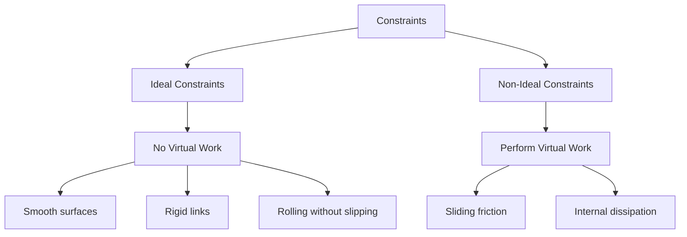

# Virtual Work

Summary: This note explores the core principles of Virtual Work, delving into its mathematical foundations and physical consequences.

## Fundamental Concepts

### Definition of Virtual Displacement
A **virtual displacement**, denoted by $\delta \mathbf{r}_i$, is an infinitesimal, instantaneous, and imaginary change in the coordinates of a system. Unlike a real displacement $d\mathbf{r}_i$, which occurs over an infinitesimal time interval $dt$, a virtual displacement is assumed to take place with time "frozen" ($dt=0$). 

For a system of $N$ particles, a virtual displacement must be consistent with the forces of constraint acting on the system at that specific instant $t$. If the system is subject to $k$ holonomic constraints of the form:
$$f_j(\mathbf{r}_1, \mathbf{r}_2, \dots, \mathbf{r}_N, t) = 0, \quad j = 1, \dots, k$$
then any set of virtual displacements $\{\delta \mathbf{r}_i\}$ must satisfy the linear variational condition:
$$\sum_{i=1}^N \nabla_i f_j \cdot \delta \mathbf{r}_i = 0$$
This implies that the virtual displacement vector is always tangent to the constraint surface (or manifold) defined by $f_j$.

### Distinction Between Real and Virtual Displacements
The distinction between real ($d\mathbf{r}$) and virtual ($\delta \mathbf{r}$) displacements is critical when dealing with **rheonomic** (time-dependent) constraints.

1.  **Temporal Dependence**: $d\mathbf{r}$ incorporates the motion of the constraint itself, while $\delta \mathbf{r}$ does not.
2.  **Mathematical Expansion**:
    Using [[Generalized Coordinates]] $q_1, q_2, \dots, q_n$, the total differential of the position vector $\mathbf{r}_i(q_1, \dots, q_n, t)$ is:
    $$d\mathbf{r}_i = \sum_{j=1}^n \frac{\partial \mathbf{r}_i}{\partial q_j} dq_j + \frac{\partial \mathbf{r}_i}{\partial t} dt$$
    In contrast, the virtual displacement is defined purely by the variations in coordinates:
    $$\delta \mathbf{r}_i = \sum_{j=1}^n \frac{\partial \mathbf{r}_i}{\partial q_j} \delta q_j$$
    Note that the term $\frac{\partial \mathbf{r}_i}{\partial t} dt$ is absent in the virtual case because $\delta t = 0$.

### The Principle of Virtual Work for Statics
The **Principle of Virtual Work** (PVW) provides a necessary and sufficient condition for the equilibrium of a mechanical system. It states that a system is in static equilibrium if and only if the total virtual work $\delta W$ done by all external and internal forces vanishes for every virtual displacement consistent with the constraints:
$$\delta W = \sum_{i=1}^N \mathbf{F}_i \cdot \delta \mathbf{r}_i = 0$$
where $\mathbf{F}_i$ is the total force acting on the $i$-th particle. In a constrained system, we can split $\mathbf{F}_i$ into **applied forces** $\mathbf{F}_i^{(a)}$ and **constraint forces** $\mathbf{f}_i$:
$$\sum_{i=1}^N \mathbf{F}_i^{(a)} \cdot \delta \mathbf{r}_i + \sum_{i=1}^N \mathbf{f}_i \cdot \delta \mathbf{r}_i = 0$$
For a large class of physical systems (ideal constraints), the second term vanishes, allowing us to determine equilibrium solely from the applied forces.

### Physical Intuition: The Vanishing Work of Constraints
The power of the PVW stems from the fact that for **ideal constraints**, the constraint forces do no work during a virtual displacement. This "workless" nature arises from the geometry of the constraint:
*   **Normal Forces**: For a particle moving on a smooth surface, the constraint force $\mathbf{N}$ is normal to the surface, while $\delta \mathbf{r}$ is tangent to it. Thus, $\mathbf{N} \cdot \delta \mathbf{r} = 0$.
*   **Tension**: In a system of particles connected by inextensible strings, the work done by tension on one end is exactly cancelled by the work done on the other end during a virtual displacement that preserves the string length.
*   **Rigid Bodies**: Internal forces between particles in a rigid body act along the line joining them. Any virtual displacement that preserves the distance between particles is perpendicular to these internal forces.

### Classification of Constraints: Ideal vs. Non-Ideal
Constraints are categorized based on whether they contribute to the virtual work:

*   **Ideal Constraints**: Defined as constraints where $\sum \mathbf{f}_i \cdot \delta \mathbf{r}_i = 0$. This allows the elimination of unknown constraint forces from the equations of equilibrium.
*   **Non-Ideal Constraints**: If friction is present, $\mathbf{f}_i \cdot \delta \mathbf{r}_i \neq 0$. In such cases, the principle must be extended by explicitly including the work of friction or using the **Principle of Virtual Work** in its inequality form for unilateral constraints.

---SIMULATION:python:virtual_work_lever.py---
import numpy as np
import matplotlib.pyplot as plt

def simulate_lever_equilibrium(L1=2.0, L2=1.0, F1=10.0):
    """
    Visualizes the Principle of Virtual Work on a simple lever.
    For equilibrium: F1*L1 = F2*L2.
    Virtual work: F1*dy1 + F2*dy2 = 0.
    """
    # Calculate F2 required for equilibrium
    F2 = F1 * (L1 / L2)
    
    # Lever coordinates (horizontal equilibrium)
    x = np.array([-L1, L2])
    y = np.array([0, 0])
    
    # Small virtual displacement (virtual rotation d_theta)
    d_theta = 0.15
    dy1 = -L1 * d_theta
    dy2 = L2 * d_theta
    
    fig, ax = plt.subplots(figsize=(10, 5))
    
    # Plot Lever
    ax.plot([-L1, L2], [0, 0], 'k-', lw=4, label='Lever Arm')
    ax.plot(0, 0, 'r^', ms=20, label='Fulcrum')
    
    # Plot Forces
    ax.arrow(-L1, 0, 0, -F1/5, width=0.05, color='blue', label=f'Applied Force F1={F1}N')
    ax.arrow(L2, 0, 0, -F2/5, width=0.05, color='green', label=f'Applied Force F2={F2:.1f}N')
    
    # Plot Virtual Displacements
    ax.arrow(-L1, 0, 0, dy1, width=0.03, ls='--', color='cyan', alpha=0.6, label='Virtual Disp. δy1')
    ax.arrow(L2, 0, 0, dy2, width=0.03, ls='--', color='orange', alpha=0.6, label='Virtual Disp. δy2')
    
    # Display Work Calculation
    W1 = F1 * dy1
    W2 = F2 * dy2
    total_W = W1 + W2
    
    ax.text(-L1, 1.5, f"δW1 = F1*δy1 = {W1:.2f} J", color='blue')
    ax.text(L2-1, 1.5, f"δW2 = F2*δy2 = {W2:.2f} J", color='green')
    ax.text(-0.5, 2.5, f"Total δW = {total_W:.2f} J", weight='bold', fontsize=12)
    
    ax.set_xlim(-L1-1, L2+1)
    ax.set_ylim(-4, 4)
    ax.set_title("Principle of Virtual Work: Lever Equilibrium")
    ax.grid(True, linestyle=':')
    ax.legend(loc='lower left')
    plt.show()

if __name__ == "__main__":
    simulate_lever_equilibrium()

#### References
- [Principle of virtual action in continuum mechanics](https://arxiv.org/abs/2403.20076) - Henri Gouin (2024)
- [The Principle of Virtual Work and Its Application in Structural Engineering](https://doi.org/10.1061/(ASCE)0733-9445(1984)110:11(2601)) - Various (1984)
- *Mécanique Analytique* - J. L. Lagrange (1788)

